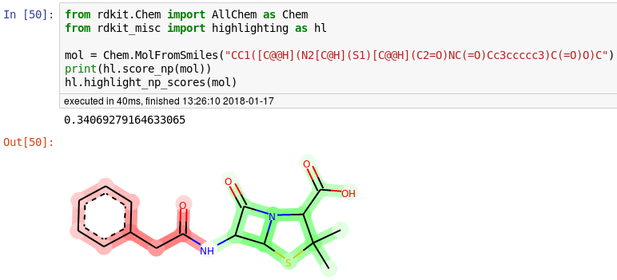

# RDKit Miscellaneous

A collection of miscellaneous personal tools for the [RDKit](http://rdkit.org/) cheminformatics toolkit.

## Modules

### highlighting
Highlighting fragment contributions of Peter Ertl's [Natural Product Likeness Score](http://pubs.acs.org/doi/abs/10.1021/ci700286x), as implemented in the RDKit:

